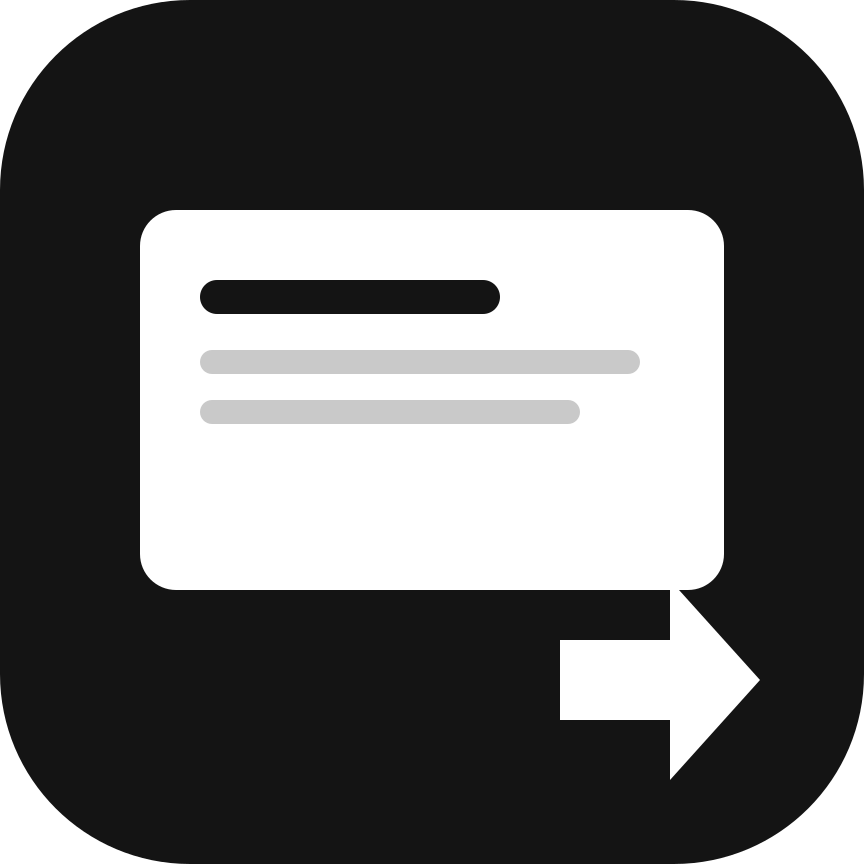
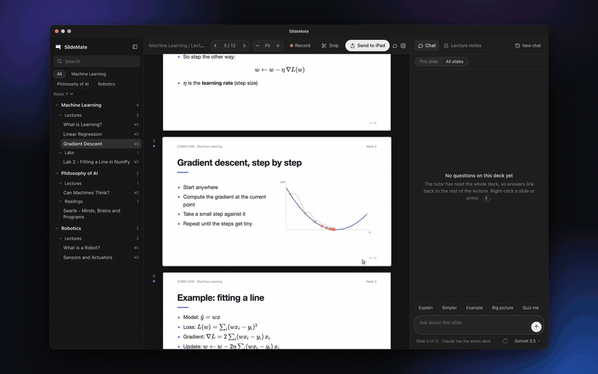
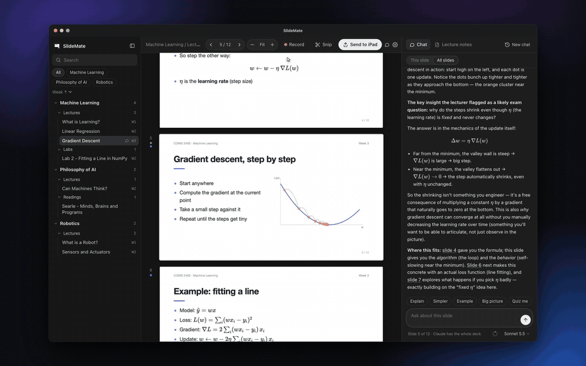
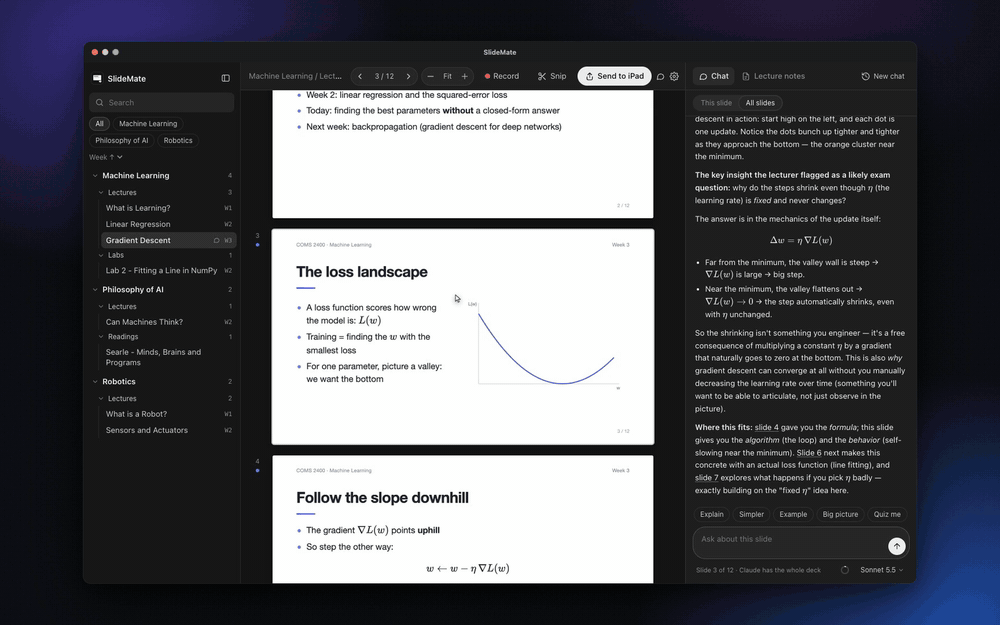
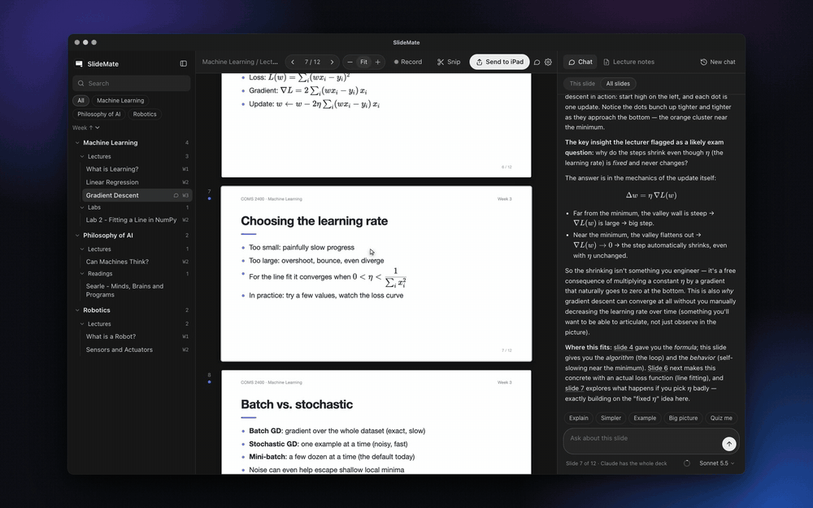

<div align="center">



# SlideMate

**Study your lecture slides with an AI tutor that has read the whole deck.**

Explain any slide in context · Snip it to your iPad in one click · Turn the lecture into notes for every slide

[](https://github.com/Mattlo0546/slidemate/releases/latest)   [](LICENSE)



</div>

**SlideMate is a free, open-source Mac app that explains lecture slides with AI.** It works with your Claude or ChatGPT account.

Lecture PDFs are terse: a few bullets, a diagram, an equation. Pasting slides into a chatbot one at a time
loses the thread. **SlideMate** is a PDF viewer for lecture decks with a tutor that has read every slide and
the lecture itself (if you recorded it). Ask about the slide you're on, and the answer explains how it connects to the rest of
the course.

It runs locally on your Mac and uses the AI you already pay for, either **Claude** (via Claude Code) or **ChatGPT**
(via Codex). No API keys, no account, no server.

## What it does

### 🧠 A tutor that knows the whole deck
Right-click → **Explain this slide** (or press <kbd>E</kbd>), or ask anything. Answers draw on the entire deck and on what
your lecturer actually said. Slide references like "slide 4" are links: hover to preview, click to jump.

<table>
<tr>
<td width="50%" valign="top">

### 📲 Snip → iPad in one click
Drag over any part of a slide and **Send to iPad**. It goes by AirDrop (SlideMate can pick your iPad for you) and is
copied to your clipboard, ready for GoodNotes or Notability.

</td>
<td width="50%" valign="top">

### 🎙️ Lecture → notes for every slide
Hit **Record** in class. SlideMate transcribes on-device with NVIDIA Parakeet, tracks which slide you were on, and writes
a summary (key ideas, to-dos, deadlines, exam tips) plus **notes for each slide with the lecturer's exact words**.

</td>
</tr>
<tr>
<td valign="top"></td>
<td valign="top"></td>
</tr>
<tr>
<td width="50%" valign="top">

### 🔍 Pinch, zoom, search
Pinch to zoom around the cursor, like Photoshop. <kbd>⌘F</kbd> searches the text of every slide, and you can select
and copy straight from the PDF.

</td>
<td width="50%" valign="top">

### 📚 Your courses, sorted
Point SlideMate at your uni folder. It sorts every PDF by **course → Lectures / Labs / Readings → week**, without moving
a single file. PDFs dropped onto the window get filed into the right course.

</td>
</tr>
<tr>
<td valign="top"></td>
<td valign="top"></td>
</tr>
</table>

### And also
- **Chats saved per slide**: revisit a slide before the exam and your questions are still there. Also saved as Markdown
  (handy for Obsidian).
- **MCP connections**: plug in your university's Blackboard or Canvas MCP server, and the tutor can check deadlines and
  announcements mid-answer. A **Pull** button syncs new slides automatically.
- **Model and effort picker**, plus a usage ring showing how much of your plan you've used, just like in Claude.
- **Private by design**: everything stays on your Mac. The only thing sent anywhere is your question to the AI provider you
  chose.

> The demo above uses an original sample lecture made for SlideMate. Answers are real, generated live by Claude.

## SlideMate vs. pasting slides into a chatbot

| | SlideMate | ChatGPT / Claude chat | NotebookLM-style tools |
| --- | --- | --- | --- |
| Knows the whole deck | Yes, every slide | Only what you paste | Yes |
| Knows which slide you're on | Yes | No | No: you chat with the whole source |
| Uses what the lecturer said | Yes, from your recording | No | If you upload a transcript |
| Slide → iPad in one click | Yes (AirDrop + clipboard) | No | No |
| Chats saved per slide | Yes | One long chat | One notebook chat |
| Where it runs | On your Mac (open source) | Web | Web |
| Cost | Free; uses your existing Claude or ChatGPT plan | Your plan | Varies |

## Quick start

**Option A: download.** Grab `SlideMate-x.y.z-macOS.zip` from the
[latest release](https://github.com/Mattlo0546/slidemate/releases/latest) and drag SlideMate into Applications
(see the [first-launch note](#download)).

**Option B: build it yourself** (it opens without any Gatekeeper prompts):

```bash
git clone https://github.com/Mattlo0546/slidemate.git && cd slidemate && scripts/install.sh
```

Either way you need **Claude Code** *or* **Codex** signed in. The setup screen checks this and has a Sign in button.

---

## Download

Get **SlideMate-x.y.z-macOS.zip** from the [latest release](https://github.com/Mattlo0546/slidemate/releases/latest).
Unzip it and drag **SlideMate** into Applications. It runs on Apple Silicon and Intel Macs with macOS 13 or later.

The app isn't notarised by Apple yet, so the first time you open it macOS will block it:
- **macOS 15 (Sequoia) and later:** try to open it, then go to System Settings → Privacy & Security, scroll down
  and click **Open Anyway**.
- **macOS 13–14:** right-click SlideMate → **Open** → **Open**.
- **Or in Terminal:** `xattr -dr com.apple.quarantine /Applications/SlideMate.app`

You'll also need:
- **Claude Code or Codex CLI, signed in.** These are the AI that does the tutoring (see the table below).
- **Apple's Command Line Tools** for Python: `xcode-select --install`. Most developers already have them.
- **Optional:** `brew install poppler ffmpeg` and `uv tool install parakeet-mlx` for ChatGPT slide text and lecture
  recording. The setup screen tells you if anything is missing.

## Install from source

Requirements: macOS 13+, [Homebrew](https://brew.sh), and Claude Code **or** Codex CLI signed in.

```bash
git clone https://github.com/Mattlo0546/slidemate.git
cd slidemate
scripts/install.sh
```

The installer adds `poppler` and `ffmpeg`, plus `parakeet-mlx` on Apple Silicon. It then builds `SlideMate.app`,
copies it to Applications and opens it. A setup screen asks for your slides folder (or creates one for you) and your
AI provider. It shows whether Claude and ChatGPT are installed and signed in, and has a **Sign in** button.

Because the app is built on your Mac, it opens normally. If you instead download a prebuilt copy, macOS will ask you
to right-click → Open the first time, since it isn't notarised.

**AI provider (pick one or both):**

| Provider | Install | Sign in |
| --- | --- | --- |
| Claude | `curl -fsSL https://claude.ai/install.sh \| bash` | `claude auth login` (Pro/Max account) |
| ChatGPT | `brew install codex` | `codex login` (ChatGPT account) |

SlideMate runs these CLIs on your behalf with your own subscription. Check each provider's terms for your plan.

## How your files are organised

```
Uni/                      ← the folder you choose in setup
├── Robotics/             ← each sub-folder is a course
│   ├── Week 01/...pdf
│   └── Lectures (SlideMate)/   ← lecture summaries, slide notes, transcripts (Markdown)
├── Philosophy of AI/
│   └── SlideMate Chats/        ← your tutor chats (Markdown)
└── _Inbox/               ← drop PDFs here and they get filed into the right course
```

SlideMate's own data lives in `~/Library/Application Support/SlideMate`: settings, chats, lecture recordings and
notes. Screenshots you send to the iPad are saved in `~/Pictures/SlideMate`.

## Send to iPad auto-select

macOS has no silent AirDrop API, so SlideMate opens the AirDrop panel and clicks your iPad for you. To enable it,
open Settings, enter your iPad's AirDrop name, click **Enable auto-select**, and turn on **SlideMate AirDrop** under
System Settings → Privacy & Security → Accessibility. Without it, you click your iPad once in the panel.

## MCP connections

Settings → **Connections (MCP)** → *Import from Claude / Codex…*, or *Add server…* with a command and arguments
(the same format as Claude Desktop's `mcpServers`).

- **Tutor**: when this is ticked, the tutor can call the server's tools mid-answer, and you'll see "Using
  blackboard › bb_upcoming…" while it works. With Claude, servers are passed via `--mcp-config` with their tools
  allowed. With Codex, they're passed as `-c mcp_servers.*` overrides with `default_tools_approval_mode="approve"`.
- **Pull**: if a server you add has a sync-style tool (e.g. `bb_sync`), SlideMate wires it to a **Pull from
  <Server>** button in the library automatically, with its sign-in tool (e.g. `bb_login`) used when the session
  has expired. Long syncs that run in the background are followed to the end by polling the matching
  `*_status` tool, and progress shows in the sidebar. You can change this under Settings → Sync.
- **Credentials**: environment variables, such as API tokens, stay in `config.json`, which only you can read. They
  are never sent to the UI.

## FAQ

**How can I get AI to explain my lecture slides?**
Open the PDF in SlideMate, right-click a slide → *Explain this slide*. The tutor has read every slide in the deck
(and your lecture notes, if you recorded the lecture), so it explains how that slide fits the rest of the course.

**Why not just paste my slides into ChatGPT?**
Pasting slides one at a time loses the rest of the lecture, and asking about "page 23" of a long PDF is clumsy.
SlideMate keeps the whole deck in context, knows which slide you're on, and saves the chat for each slide.

**How do I get a slide from my Mac into GoodNotes or Notability on my iPad?**
Click **Send to iPad**, or snip part of a slide → *Send to iPad*. It goes by AirDrop (SlideMate can pick your iPad
for you) and is copied to the clipboard for pasting via Universal Clipboard.

**Can it turn a lecture recording into notes?**
Yes. Press **Record** in class. It transcribes on-device (NVIDIA Parakeet), tracks which slide was showing, and
writes a summary plus notes for each slide with the lecturer's exact words. You can also import an Otter or Granola
transcript.

**Is it free? Is there a NotebookLM alternative for lecture slides?**
SlideMate is free and MIT-licensed, and uses the Claude or ChatGPT plan you already have, with no API key. Unlike
general "chat with your sources" tools, it's a slide viewer first: the tutor answers about the slide in front of you,
with the whole deck as context.

**Windows? iPad app?**
Not yet. It's macOS 13+ (Apple Silicon and Intel), and sends slides to your iPad.

## How it works

SlideMate is a small local web app: a Python server (standard library only) on `127.0.0.1`, and a web UI using
PDF.js, KaTeX and marked. `SlideMate.app` is a thin native window (WKWebView) that starts the server and shows the UI.

| Piece | Where |
| --- | --- |
| Server, library, chats | `server/server.py`, `server/library.py` |
| AI providers (Claude Code / Codex) | `server/providers.py` |
| MCP connections + client | `server/mcp.py` |
| Lecture recording → notes | `server/lecture.py` |
| UI | `server/static/` |
| Native app + AirDrop helper | `macos/` |

The server only listens on localhost and requires a custom header on every API call, so web pages can't reach it.

## Development

```bash
scripts/dev.sh            # runs the server from source on http://127.0.0.1:8768 with a separate data folder
scripts/build-app.sh      # builds build/SlideMate.app
```

UI changes in `server/static/` only need a page refresh. `scripts/install.sh --build-only` runs the whole installer
without touching /Applications.

## Uninstall

Delete `SlideMate.app` from Applications. Your data is in `~/Library/Application Support/SlideMate` (settings, chats,
lecture notes and recordings), so delete that folder too if you want a clean slate. Your slide folders are never touched.

## License

MIT. Bundled third-party libraries are listed in [THIRD_PARTY.md](THIRD_PARTY.md).
